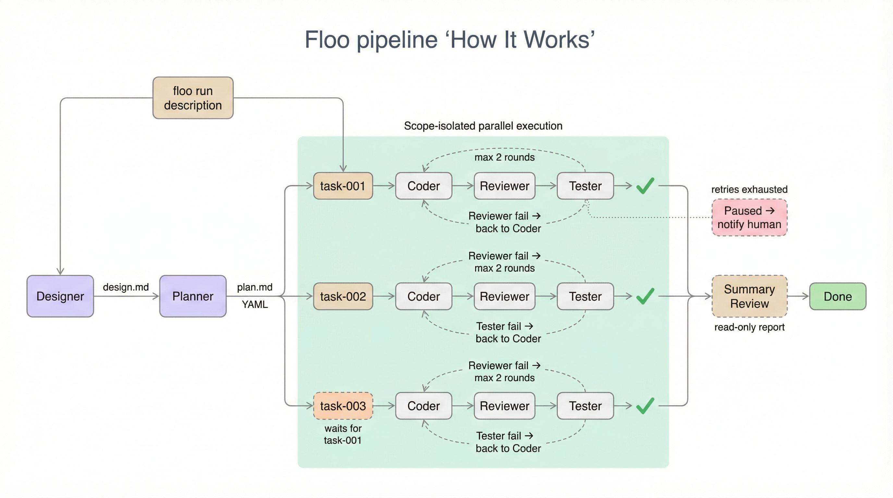

<div align="right">

[English](./README.md) | [中文](./README.zh-CN.md)

</div>

<div align="center">

# Floo

**Multi-Agent Vibe Coding Harness**

[](./LICENSE)
[](https://github.com/ayaoplus/floo)

*Coordinate Claude Code, Codex, and other AI agents through a structured pipeline — parallel execution, cross-review, automatic retry, zero polling.*

[Quick Start](#quick-start) · [How It Works](#how-it-works) · [Commands](#commands) · [Architecture](#architecture) · [Requirements](#requirements)

</div>

---

## Quick Start

**Step 1 — Install**

```bash
git clone https://github.com/ayaoplus/floo.git
cd floo
npm install && npm run build
npm link          # makes `floo` available globally
```

**Step 2 — Initialize your project**

```bash
cd /path/to/your/project
floo init
```

This creates `.floo/`, installs skill templates, and registers `SKILL.md` so any agent (CC / Codex / OpenClaw) can discover and call floo automatically.

**Step 3 — Run**

```bash
floo run "Add user authentication to the API"
floo monitor          # live progress feed
```

---

## How It Works



**Failure handling**
| Situation | Behavior |
|-----------|----------|
| Reviewer fail | Back to Coder — max 2 rounds |
| Tester fail | Back to Coder → Reviewer → Tester — max 2 rounds |
| Phase crash | Retry with error context — max 3 attempts |
| All retries exhausted | Pause and notify human |

---

## Why Floo?

- **Zero polling** — tmux `wait-for` signals deliver phase transitions instantly, no busy-wait loops
- **Cross-review by default** — Reviewer uses a different runtime than Coder (e.g. Codex reviews Claude's code)
- **Scope isolation** — each task is locked to specific files; a commit lock prevents parallel tasks from colliding
- **Headless** — Floo is a CLI dispatcher; any agent, script, or terminal can call it
- **Universal skill standard** — one `SKILL.md` at the project root works with Claude Code, Codex, and OpenClaw
- **Bring your own agents** — configure which runtime and model each role uses in `floo.config.json`

---

## Agent Roles

| Role | Responsibility | Output |
|------|---------------|--------|
| **Designer** | Requirements analysis, scope definition | `design.md` |
| **Planner** | Task decomposition, dependency ordering | `plan.md` (strict YAML) |
| **Coder** | Write code, atomic commits | git commits |
| **Reviewer** | Code review — read-only | `review.md` (pass / fail) |
| **Tester** | E2E / integration testing | `test-report.md` (pass / fail) |

Default bindings (override in `floo.config.json`):

```json
{
  "roles": {
    "designer": { "runtime": "claude", "model": "claude-sonnet-4-5" },
    "planner":  { "runtime": "claude", "model": "claude-sonnet-4-5" },
    "coder":    { "runtime": "claude", "model": "claude-sonnet-4-5" },
    "reviewer": { "runtime": "codex",  "model": "codex-mini" },
    "tester":   { "runtime": "claude", "model": "claude-sonnet-4-5" }
  }
}
```

---

## Commands

| Command | Description |
|---------|-------------|
| `floo init` | Initialize floo in the current project |
| `floo init --with-playwright` | Also install Playwright for E2E testing |
| `floo run "<description>"` | Run a new task through the full pipeline |
| `floo run "<description>" --detach` | Run in background, return immediately |
| `floo status` | Snapshot of current batch and task states |
| `floo monitor` | Live notification stream |
| `floo cancel <batch-id>` | Cancel a running batch |
| `floo learn` | Display accumulated lessons from past runs |
| `floo sync` | Sync skill templates and config to latest version |

---

## Architecture


Floo operates across three layers:

| Layer | Components | Role |
|-------|-----------|------|
| **Interaction** | Claude Code · Codex · OpenClaw | Human-facing agents that call `floo run` |
| **Orchestration** | Floo CLI · Dispatcher · Router / Scope Lock | State machine, parallel scheduling, commit lock |
| **Execution** | designer · planner · coder · reviewer · tester | Worker agents spawned per phase in tmux sessions |

The callback mechanism uses `tmux wait-for` — no polling, no websockets, zero latency between phases.


---

## Project Structure

```
floo/
├── src/
│   ├── core/          # Dispatcher, adapters, router, scope, monitor, types
│   └── commands/      # CLI commands (init, run, status, cancel, monitor)
├── skills/            # Skill templates (designer, planner, coder, reviewer, tester)
├── templates/         # Git hooks, config templates
├── web/               # Next.js monitoring dashboard (M4, in progress)
├── docs/
│   ├── design.md      # Full design document
│   └── dev-plan.md    # Development roadmap
└── SKILL.md           # Universal agent integration file (CC / Codex / OpenClaw)
```

---

## Requirements

| Requirement | Version | Notes |
|-------------|---------|-------|
| macOS | 12+ | tmux session management |
| Node.js | 18+ | ESM support required |
| tmux | 3.3+ | `wait-for` flag required |
| Git | any | Commit lock and scope tracking |

At least one AI coding agent:

| Agent | Install |
|-------|---------|
| [Claude Code](https://docs.anthropic.com/claude-code) | `npm install -g @anthropic-ai/claude-code` |
| [Codex CLI](https://github.com/openai/codex) | `npm install -g @openai/codex` |
| OpenClaw | see project docs |

---

## Development Status

| Milestone | Status | Description |
|-----------|--------|-------------|
| M1: Single task | ✅ Done | `floo init → run → status` end-to-end |
| M2: Multi-task + quality | ✅ Done | Parallel dispatch, compile gate, detach mode, tester, batch summary |
| M3: Operations | 🔄 In progress | Lessons, config sync, health checks |
| M4: Web UI | 📋 Planned | Next.js monitoring dashboard |

---

## Design Philosophy

> *Dispatcher, not engine. tmux + file signals, not frameworks. Skill templates are the product.*

- **Headless orchestration** — Floo coordinates; agents do the work
- **Zero-latency callbacks** — `tmux wait-for` fires on signal file creation, not a poll loop
- **Scope-first isolation** — scope locks prevent agents from stepping on each other's commits
- **No over-engineering** — if it's not needed yet, it's not built

---

## License

MIT — see [LICENSE](./LICENSE)
