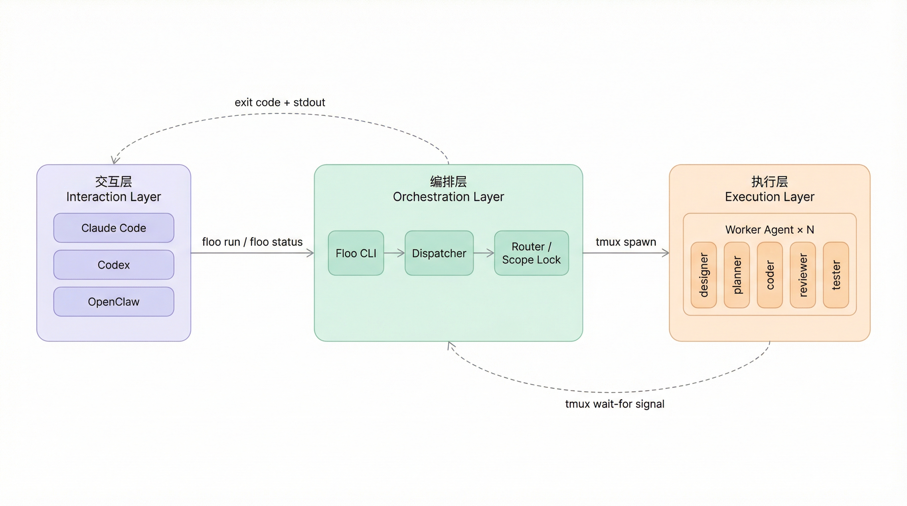
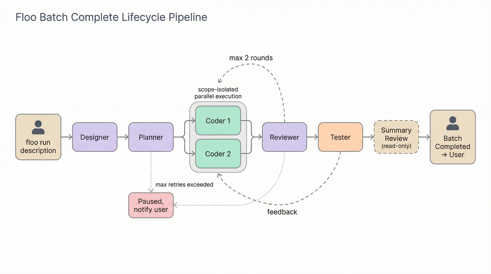

<div align="right">

[English](./README.md) | [中文](./README.zh-CN.md)

</div>

<div align="center">

# Floo

**Multi-Agent Vibe Coding Harness**

[](./LICENSE)
[](https://github.com/ayaoplus/floo)

*将 Claude Code、Codex 等多个 AI agent 通过结构化流水线协调起来——并行执行、交叉审核、自动重试、零轮询回调。*

[快速开始](#快速开始) · [工作原理](#工作原理) · [命令](#命令) · [架构](#架构) · [环境要求](#环境要求)

</div>

---

## 快速开始

**第一步 — 安装**

```bash
git clone https://github.com/ayaoplus/floo.git
cd floo
npm install && npm run build
npm link          # 全局注册 floo 命令
```

**第二步 — 初始化项目**

```bash
cd /path/to/your/project
floo init
```

这会创建 `.floo/` 目录、安装 skill 模板，并注册 `SKILL.md`，让任何 agent（CC / Codex / OpenClaw）都能自动发现并调用 floo。

**第三步 — 运行**

```bash
floo run "给 API 加上用户认证"
floo monitor          # 实时进度流
```

---

## 工作原理

```
用户描述任务
  │
  ├─ Designer  →  需求分析 + scope 定义  (design.md)
  ├─ Planner   →  任务拆分                (plan.md YAML)
  │
  ├─ Scope 隔离并行执行
  │   ├─ task-001: Coder → Reviewer → Tester  ✓
  │   ├─ task-002: Coder → Reviewer → Tester  ✓
  │   └─ task-003: 等待 task-001 → Coder → Reviewer → Tester  ✓
  │
  └─ 整体 Review（只读批次报告）
```

**失败处理**
| 情况 | 行为 |
|------|------|
| Reviewer fail | 回到 Coder — 最多 2 轮 |
| Tester fail | 回到 Coder → Reviewer → Tester — 最多 2 轮 |
| 阶段崩溃 | 带错误上下文重试 — 最多 3 次 |
| 重试耗尽 | 暂停并通知人工介入 |

---

## 为什么用 Floo？

- **零轮询** — 用 tmux `wait-for` 信号驱动阶段切换，不做忙等循环
- **默认交叉审核** — Reviewer 使用和 Coder 不同的 runtime（如 Codex 审核 Claude 的代码）
- **Scope 隔离** — 每个任务只能修改指定文件，commit 锁防止并行任务相互冲突
- **无头设计** — Floo 是 CLI 调度器，任何 agent、脚本或终端都能调用
- **通用 skill 标准** — 项目根目录的一个 `SKILL.md` 同时兼容 Claude Code、Codex 和 OpenClaw
- **自由配置 agent** — 在 `floo.config.json` 中指定每个角色使用哪个 runtime 和模型

---

## Agent 角色

| 角色 | 职责 | 产出 |
|------|------|------|
| **Designer** | 需求分析、scope 定义 | `design.md` |
| **Planner** | 任务拆分、依赖编排 | `plan.md`（严格 YAML） |
| **Coder** | 写代码、原子提交 | git commits |
| **Reviewer** | 代码审查 — 只读不改 | `review.md`（pass / fail） |
| **Tester** | E2E / 集成测试 | `test-report.md`（pass / fail） |

默认绑定（可在 `floo.config.json` 中覆盖）：

```json
{
  "roles": {
    "designer": { "runtime": "claude", "model": "claude-sonnet-4-5" },
    "planner":  { "runtime": "claude", "model": "claude-sonnet-4-5" },
    "coder":    { "runtime": "claude", "model": "claude-sonnet-4-5" },
    "reviewer": { "runtime": "codex",  "model": "codex-mini" },
    "tester":   { "runtime": "claude", "model": "claude-sonnet-4-5" }
  }
}
```

---

## 命令

| 命令 | 说明 |
|------|------|
| `floo init` | 在当前项目中初始化 floo |
| `floo init --with-playwright` | 同时安装 Playwright 用于 E2E 测试 |
| `floo run "<描述>"` | 启动一个完整流水线任务 |
| `floo run "<描述>" --detach` | 后台运行，立即返回 |
| `floo status` | 查看当前批次和任务状态快照 |
| `floo monitor` | 实时通知流 |
| `floo cancel <batch-id>` | 取消运行中的批次 |
| `floo learn` | 查看历次运行积累的经验 |
| `floo sync` | 同步 skill 模板和配置到最新版本 |

---

## 架构



Floo 分三层运作：

| 层 | 组件 | 职责 |
|----|------|------|
| **交互层** | Claude Code · Codex · OpenClaw | 与人交互的 agent，负责调用 `floo run` |
| **编排层** | Floo CLI · Dispatcher · Router / Scope Lock | 状态机、并行调度、commit 锁 |
| **执行层** | designer · planner · coder · reviewer · tester | 每个阶段在独立 tmux session 中运行的 worker agent |

回调机制使用 `tmux wait-for`——无轮询、无 websocket，阶段切换零延迟。



---

## 项目结构

```
floo/
├── src/
│   ├── core/          # 调度器、适配器、路由、scope 管理、监控、类型定义
│   └── commands/      # CLI 命令（init, run, status, cancel, monitor）
├── skills/            # Skill 模板（designer, planner, coder, reviewer, tester）
├── templates/         # Git hooks、配置模板
├── web/               # Next.js 监控面板（M4，进行中）
├── docs/
│   ├── design.md      # 完整设计文档
│   └── dev-plan.md    # 开发路线图
└── SKILL.md           # 通用 agent 集成文件（CC / Codex / OpenClaw）
```

---

## 环境要求

| 依赖 | 版本 | 说明 |
|------|------|------|
| macOS | 12+ | tmux session 管理 |
| Node.js | 18+ | 需要 ESM 支持 |
| tmux | 3.3+ | 需要 `wait-for` 标志 |
| Git | 任意 | commit 锁和 scope 追踪 |

至少需要一个 AI 编码 agent：

| Agent | 安装 |
|-------|------|
| [Claude Code](https://docs.anthropic.com/claude-code) | `npm install -g @anthropic-ai/claude-code` |
| [Codex CLI](https://github.com/openai/codex) | `npm install -g @openai/codex` |
| OpenClaw | 见项目文档 |

---

## 开发进度

| 里程碑 | 状态 | 说明 |
|--------|------|------|
| M1: 单任务 | ✅ 已完成 | `floo init → run → status` 全链路打通 |
| M2: 多任务 + 质量提升 | ✅ 已完成 | 并行调度、编译门禁、后台模式、tester、批次总结 |
| M3: 运维与进化 | 🔄 进行中 | 经验积累、配置同步、健康检查 |
| M4: Web UI | 📋 计划中 | Next.js 可视化监控面板 |

---

## 设计哲学

> *做调度器，不做引擎。tmux + 文件信号，不用框架。Skill 模板才是产品。*

- **无头编排** — Floo 负责协调，agent 负责干活
- **零延迟回调** — `tmux wait-for` 在信号文件创建时立即触发，不做轮询
- **Scope 优先隔离** — scope 锁防止 agent 之间的 commit 冲突
- **如无必要勿增实体** — 还不需要的功能就不做

---

## License

MIT — 见 [LICENSE](./LICENSE)
