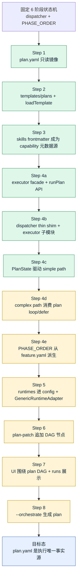
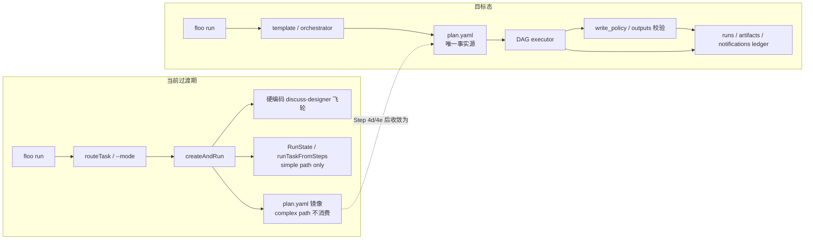
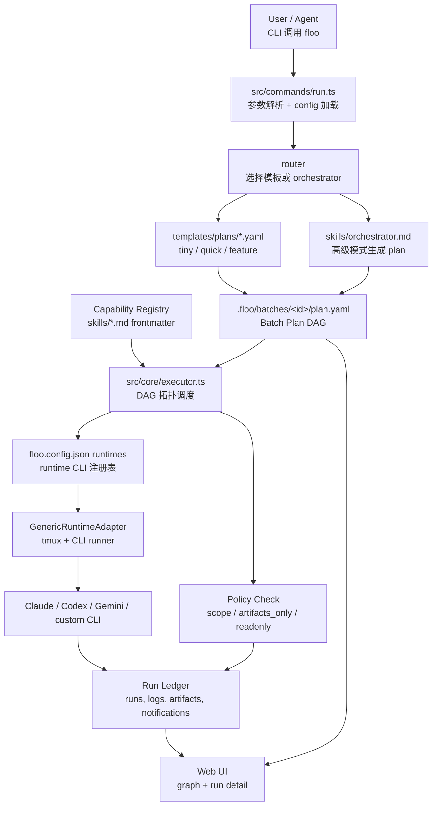
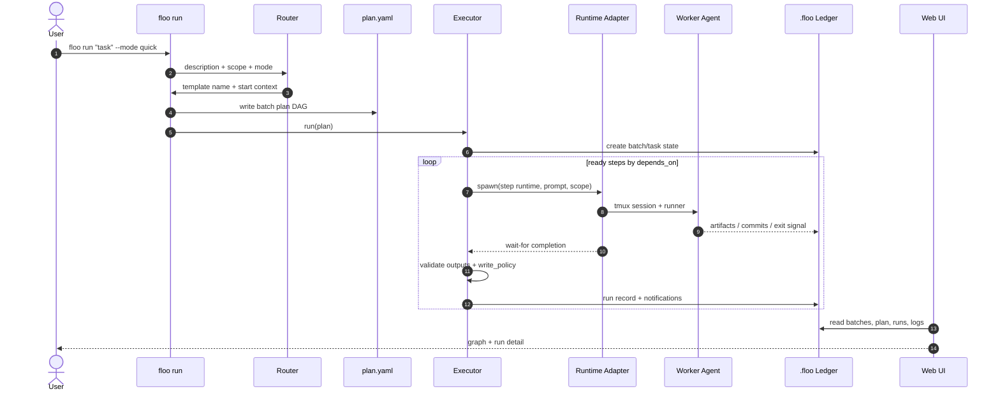
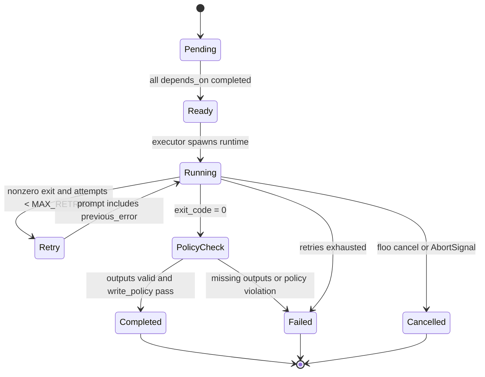
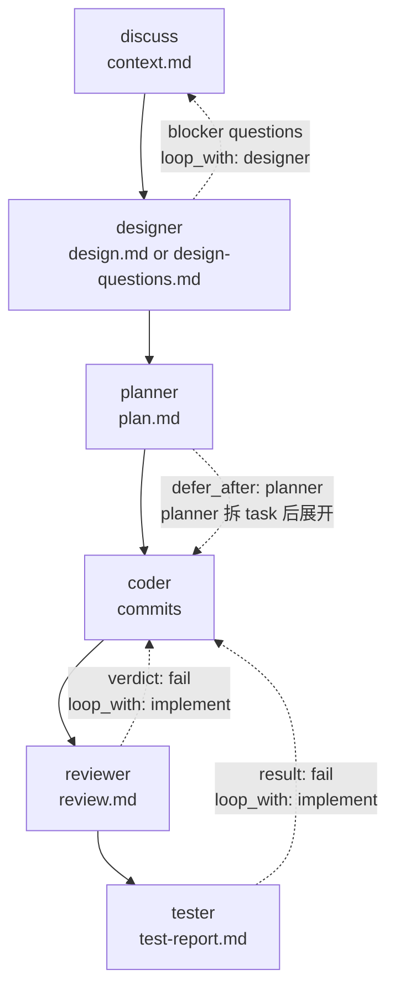
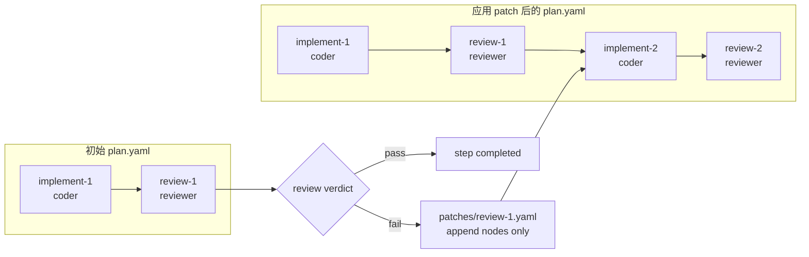
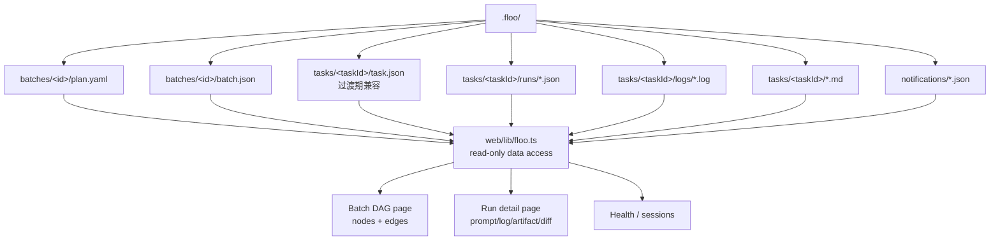

# Floo Refactor Plan

> 目标:从当前固定 6 阶段管线 → [docs/design.md](./design.md) 描述的 plan-driven DAG 架构。
>
> 原则:**渐进迁移,旧测试不删,每一步都能跑通**。任何一步落地后,`npm test` 必须 100% 通过。

## 总体策略

整个重构按"先建底座,再换芯片"的顺序推进:

```
1. plan.yaml 落盘(只读不变行为)
   ↓
2. PHASE_ORDER → feature.yaml 模板
   ↓
3. skills frontmatter (事实源就位)
   ↓
4. executor 替换 dispatcher (一次到位读 frontmatter)
   ↓
5. runtimes 进 config (adapter 通用化)
   ↓
6. plan-patch 机制
   ↓
7. UI 改造 (graph + runs)
   ↓
8. --orchestrate (高级模式)
```

每一步都是**独立可发布**的状态。任何一步如果发现方案有问题,可以停在那里继续观察使用,而不影响日常使用 Floo。

---

## 架构与数据流图

本节用于把重构主线的关键结构可视化。所有图都是 Mermaid 源码,与本文档一起维护;当 Step 4d/4e/5/6/7/8 的实际落地方式变化时,优先同步这些图,再同步下方逐步计划。

### 1. 重构路线总览



### 2. 过渡期控制面与目标控制面



### 3. 目标运行时架构



### 4. `floo run` 数据流



### 5. 单个 step 生命周期



### 6. `feature.yaml` DAG 与过渡期循环语义



### 7. Plan-patch 追加节点模型



### 8. Web UI 读模型



---

## Step 1: plan.yaml 落盘 (只读模式)

### 目标

每次 `floo run` 在 `.floo/batches/<batchId>/plan.yaml` 落一份执行图,但 dispatcher 行为完全不变,plan.yaml 只是**当前状态机决策的镜像**。先把数据模型和文件落地,让后续 UI 和 executor 改造有锚点。

### 输入

- 当前 `dispatcher.ts` 的 `PHASE_ORDER` + 任务参数

### 输出

- `.floo/batches/<id>/plan.yaml` 文件(每次 run 一份)
- `src/core/plan.ts` 新模块:plan schema 定义 + 序列化
- 测试:`test/plan.test.ts` 覆盖序列化往返

### 不做

- 不改 dispatcher 行为
- 不让 dispatcher 读 plan(它仍然走代码内状态机)
- 不引入 capability 概念

### 验收

- `floo run` 后能看到 plan.yaml,内容正确反映当次执行的 phase 顺序、依赖、scope
- 现有测试全过

### 风险

低。纯增量。

---

## Step 2: 引入 templates/plans/ 与 loadTemplate()(纯文档/loader,不影响行为)

### 目标

仅落地两件事:

1. 建立 `templates/plans/` 目录,放入 `feature.yaml` 作为**当前固定 6 阶段管线的等价文档**(只是文档,不被消费)
2. 新增 `src/core/plan.ts` 中的 `loadTemplate(name)` 函数,纯 IO + 解析,**不被 dispatcher 调用**

**这一步明确不承诺任何行为变化**。`PHASE_ORDER` 常量保持当前硬编码值不变,dispatcher 一行不动。

### 为什么不在这步把模板"接上"

事实核对:`src/core/dispatcher.ts:1438-1499` 显示当前 `createAndRun` 有大量**绕过 `PHASE_ORDER` 的硬编码逻辑**:

- `:1438` `if (startIdx >= coderIdx)` → coder/reviewer/tester 短路,完全不按 PHASE_ORDER 顺序推进
- `:1499` `if (startPhase === 'discuss' || startPhase === 'designer')` → 进入硬编码的 discuss/designer 飞轮,飞轮内部 phase 顺序也是写死的
- 飞轮之后才进入 planner → coder → reviewer → tester 的常规推进

这意味着**仅把 `PHASE_ORDER` 来源改成 yaml,大部分行为不会随 yaml 变化**。用户编辑 `feature.yaml` 把 designer 删掉,飞轮代码仍然会跑 designer——给用户一个"编辑模板能改变行为"的承诺,实际是半真半假。

同样,`PHASE_ORDER` 是**模块级 export**,只在进程启动时确定一次,无法 per-run 切换。tiny/quick/feature 三个 mode 不能通过"加载不同 yaml 改 PHASE_ORDER"实现——同一进程内多个并发任务会互相污染。

**结论**:真正的模板驱动行为切换,要等 Step 4 的 executor 落地,把 dispatcher 里那些硬编码分支一起换成 plan.yaml 拓扑驱动。Step 2 不要假装能做到。

### 输入

- Step 1 完成(plan.yaml 落盘数据模型稳定)

### 输出

- `templates/plans/feature.yaml`:与当前 6 阶段语义等价的**文档**(注释里说明"当前未被 dispatcher 消费,Step 4 之后生效")
- `src/core/plan.ts` 加 `loadTemplate(name): PlanTemplate`:同步读 yaml + schema 校验
- 单测:`loadTemplate('feature')` 返回结构化对象,字段齐全
- Step 1 落盘的 plan.yaml 在 metadata 段加一行 `template: feature`,标注"这次执行的 plan 来源于哪份模板"(纯标记,无运行时影响)

### 不做

- ❌ 不改 `PHASE_ORDER` 来源,仍是硬编码常量
- ❌ 不加 `tiny.yaml` / `quick.yaml`(没有消费方,先不写,Step 4 用到时再加)
- ❌ 不让 router 选模板
- ❌ 不让 dispatcher 调用 `loadTemplate()`
- ❌ 不引入 `--mode` 标志
- ❌ 不加 frontmatter(Step 3)
- ❌ 不动 runtime adapter

### 验收

- `loadTemplate('feature')` 单测通过,返回结构与 plan.yaml schema 一致
- `feature.yaml` 内容与当前实际 6 阶段行为对齐(人工审查 + 一份 mapping 注释)
- `npm test` 100% 通过(本步对运行时零影响)
- 用户编辑 `templates/plans/feature.yaml` **不会改变 Floo 行为**——这是预期的,文档要明说

### 风险

低。纯增量,无消费方。

### 与 Codex review 的对应

- Codex Major #2:✅ 不再承诺 PHASE_ORDER 派生 + 行为变化
- Codex Major #3:✅ 不再承诺 tiny/quick mode 跑通,这些模板及其行为推迟到 Step 4

---

## Step 3: Skill Frontmatter (capability 元数据)

### 目标

把每个 `skills/*.md` 加上 frontmatter,声明 `name / write_policy / outputs / default_runtime / default_model / inputs`。skill loader 解析 frontmatter 并暴露 metadata API。

**这一步是 Step 4 的前置:executor 替换 dispatcher 时,要直接从 frontmatter 读 write_policy 等信息,而不是 hardcode。**

### 输入

- 现有 `skills/*.md`
- 设计文档里 capability 表格

### 输出

- 6 个 skill 文件加 frontmatter:
  - `discuss.md`:`write_policy: artifacts_only, outputs: [context.md], default_runtime: claude, default_model: opus`
  - `designer.md`:`write_policy: artifacts_only, outputs: [design.md, design-questions.md], default_runtime: claude, default_model: opus`
  - `planner.md`:`write_policy: artifacts_only, outputs: [plan.md], default_runtime: claude, default_model: sonnet`
  - `coder.md`:`write_policy: scope, outputs: [commits], default_runtime: claude, default_model: sonnet`
  - `reviewer.md`:`write_policy: readonly, outputs: [review.md], default_runtime: codex, default_model: codex-mini`
  - `tester.md`:`write_policy: readonly, outputs: [test-report.md], default_runtime: claude, default_model: sonnet`
- `src/core/skills/loader.ts` 解析 frontmatter,返回 `{metadata, body}`
- `src/core/types.ts` 加 `CapabilityMetadata` 类型
- 测试:loader 单测覆盖 frontmatter 解析

### 不做

- 不让 dispatcher / executor 强制执行 write_policy(下一步才做)
- 不动 runtime adapter
- 不加新的 capability

### 验收

- `loader.load("coder")` 返回 metadata + body,metadata 字段齐全
- 现有 dispatcher 仍能通过 loader 获取 prompt body(向后兼容)
- 现有测试全过

### 风险

低。frontmatter 是纯元数据,运行时还没消费。

---

## Step 4: Executor 替换 Dispatcher (核心一步)

> **当前进度(2026-05)**:Step 4 拆成 4a/4b/4c/4d/4e 五个子步,**4a/4b/4c/4d/4e 全部已 Done**。
>
> 已落地:executor facade 上线、dispatcher 1661→18 行 thin shim、tiny/quick/feature 模板、`floo run --mode`、PlanState 驱动 simple path、createAndRun 在 complex path 上按 plan 拓扑(loop_with / defer_after / capability)分流、PHASE_ORDER 从 feature.yaml 派生。
>
> 仍未落地的更高阶目标:
> - **`runPlan(plan, opts)`**:当 `plan.mode === 'executor'` 时仍抛 unsupported(`src/core/executor.ts:62`)。这条路径需要 Step 6 的 plan-patch 机制才能完整支撑(否则 executor 模式下飞轮无法表达),所以与 Step 4 解耦留待 Step 6 后启用。
>
> Step 4 收尾后,用户编辑 `templates/plans/feature.yaml` 调整 phase 顺序、删除 phase、移除 loop_with 飞轮关系,均会被 `floo run --mode feature` 实际消费;`floo run` 不带 `--mode` 走老 startPhase 推断路径继续保持向后兼容。

### 目标

新写一个 `src/core/executor.ts`,以 plan.yaml 为唯一输入驱动调度。`dispatcher.ts` 退化为 compatibility shim,内部委托 executor。frontmatter 中的 `write_policy` / `outputs` 由 executor 在 step 完成后强制校验(事后检测,见 design.md 中 write_policy 章节)。

**这一步首次承诺"模板驱动行为变化"**(注:complex path 部分要等 4d 落地)。具体涵盖:

1. dispatcher 中 `:1438` 的 coder 短路、`:1499` 的 discuss/designer 飞轮等硬编码分支,**全部翻译成 plan.yaml 节点 + depends_on**。短路 = router 生成更短的 plan;飞轮 = 通过 plan-patch (Step 6) 表达,但 Step 4 阶段先用 executor 内置的"feature.yaml 等价模式"承接(见下方"飞轮的过渡处理")
2. `tiny.yaml` / `quick.yaml` 模板加入 `templates/plans/`,并由 router 根据任务关键词或 `--mode` 选用
3. `floo run --mode tiny|quick|feature` 各模板都能跑通,**因为 executor 现在直接消费 plan.yaml**,而不是通过模块级 `PHASE_ORDER` 间接控制

### 输入

- Step 1-3 完成
- Step 2 落地的 `loadTemplate()` 在 Step 4 第一次被实际调用
- 各 skill 的 frontmatter

### 输出

- `src/core/executor.ts`:DAG 拓扑调度循环 + `write_policy` 事后校验
- `src/core/router.ts`:改成"任务 → plan template name"的选择器
- `templates/plans/tiny.yaml`:仅 coder
- `templates/plans/quick.yaml`:coder → reviewer
- `src/core/scope.ts`:沿用,接口微调以匹配 plan 节点
- `src/core/dispatcher.ts`:**保留为 compatibility shim**(不删),内部委托 executor
- 现有测试**不改**继续通过

### 飞轮的过渡处理

`discuss → designer` 飞轮在当前实现里是循环结构(designer 输出 blocker → 回 discuss round 2)。Step 4 不引入 plan-patch,因此飞轮在这一步用 executor 的**内置循环模式**承接:

- `feature.yaml` 中 discuss step 的 frontmatter 加 `loop_with: designer`
- executor 识别到这个标记,在 designer 完成且产出 design-questions 含 blocker 时,自动重跑 discuss + designer,直到 `loop_limits.max_discuss_rounds`
- review/test 失败回 coder 同理处理

这是过渡期的"硬编码循环模式"。Step 6 plan-patch 落地后,这种模式可以被 worker 输出 patch 取代,但 Step 4 不强求。

### 测试迁移策略 (源码 shim 而不是 test helper)

事实:旧 `test/dispatcher.test.ts` 和 `test/core.test.ts` 直接 import 了:
- `PHASE_ORDER` from `src/core/types.ts`(`test/core.test.ts:18`)
- `runTask, createAndRun, type DispatcherOptions` from `src/core/dispatcher.ts`(`test/dispatcher.test.ts:11`)

加 `test/helpers/dispatcher-shim.ts` **救不了**这些直接 import。正确做法是**在源码层保留兼容 export**:

1. **`PHASE_ORDER` 保留为硬编码常量**:Step 2 没有改它的来源,Step 4 也不改。它在新架构下只是向后兼容 export(测试和潜在外部消费者),executor 内部不读它,只读 plan.yaml。如果未来想让它从 `feature.yaml` 派生,作为独立清理任务,不在重构主线里。
2. **`runTask` 保留为 thin wrapper**:
   ```ts
   export async function runTask(task, startPhase, opts) {
     const plan = synthesizeSinglePlan(task, startPhase, opts);
     const result = await executor.run(plan, opts);
     return adaptToLegacyResult(result);  // 把 executor 的输出格式翻译回旧契约
   }
   ```
3. **`createAndRun` 同理**:内部转 plan + 调 executor,但 export 签名和返回值结构不变。
4. **`DispatcherOptions` 类型保留**:可以是 `ExecutorOptions` 的别名或子集。
5. 旧测试一行不改,`npm test` 必须 100% 过。
6. 全过且观察期(1-2 周本机使用)无回归后,**新写** `test/executor.test.ts` 直接覆盖 plan-driven 路径。
7. 当 executor 测试覆盖等价于旧测试时,才允许把旧测试中"过时的 phase 概念"删掉,但 shim 本身可以保留更久,作为外部消费者(OpenClaw 等)的稳定接口。

**关键约束**:Step 4 不删 `dispatcher.ts`,只是把内部实现换成委托给 executor。"删除 dispatcher" 这件事推迟到测试和外部消费者都迁移完之后,可能是 Step 7 之后的清理工作。

### 不做

- 不引入 plan-patch(下一步才做,本步 plan 是静态的)
- 不改 runtime adapter
- 不改 UI
- 不删 `dispatcher.ts`(只换内部实现)
- 不删 `runTask` / `createAndRun` / `PHASE_ORDER` 任何 export

### 验收

- 旧测试 100% 通过,**且 import 行不动**
- 用户跑 `floo run` 行为与重构前完全一致
- `src/core/dispatcher.ts` 内部不再包含 phase 状态推进逻辑,改为构造 plan + 调用 executor

### 风险

**高**。这是整个重构最危险的一步。建议:

- 拉一个独立分支,跑通再合并
- 落地前先把 Step 1-3 用一段时间,确保 plan.yaml 数据模型稳定
- 落地后留 1-2 周观察期再做 Step 5
- 把 `runTask` / `createAndRun` 的输出契约**写成断言加进新 executor 测试**,防止之后的重构悄悄破坏外部消费者

---

## Step 5: Runtimes 进 Config (adapter 通用化)

> **当前进度(2026-05)**:✅ Done。`runtimes` 段 + `GenericRuntimeAdapter` + `loadAdapters` 全部落地;`ClaudeAdapter` / `CodexAdapter` 退化为 GenericRuntimeAdapter 的 preset(仍 export 兼容外部消费者);commands/run.ts 与 cancel.ts 改用 `loadAdapters(config)`,自定义 runtime 即配即用,无需 TS 子类。`stdout/stderr 解析策略`(原计划风险点)在当前实现里**没引入**:floo 通过 exit artifact 文件 + tmux wait-for 通信,不依赖 stdout 解析,所以 Generic adapter 不需要每个 CLI 写一份输出 parser。

### 目标

`floo.config.json` 增加 `runtimes` 段。新写一个 `GenericRuntimeAdapter`,根据配置启动 tmux + 执行 CLI + 解析输出。`adapters/{claude,codex}.ts` 退化为兜底,直至验证通用 adapter 稳定。

### 输入

- Step 4 完成
- `runtimes` 配置 schema 设计

### 输出

- `src/core/runtimes.ts`:加载 runtime 注册表
- `src/core/adapters/generic.ts`:通用 adapter
- `floo.config.json` schema 加 `runtimes` 段
- `floo init` 默认写入 claude / codex 两个 runtime
- 测试:`test/runtimes.test.ts` 覆盖配置加载 + adapter 启动

### 验收

- 用户在 config 里加一个 `gemini` runtime 配置后,plan 中可指定 `runtime: gemini` 并成功启动 Gemini CLI(假设已安装)
- 不再需要为每种 runtime 写 TypeScript 子类

### 风险

中。不同 CLI 的 stdout/stderr 格式差异大,通用 adapter 需要可配置的输出解析策略。

---

## Step 6: Plan-Patch 机制

> **当前进度(2026-05)**:✅ Done(数据机制完整 + 局部执行接通)。
>
> 已落地:
> - `src/core/plan-patch.ts`:`PlanPatch` schema、`applyPatch`、`writePatch`、`readPatches`、`validatePatch`,append-only 校验完整(parent_step 存在 / id 不冲突 / depends_on 合法)
> - `runStateMachine` 在 reviewer-fail / tester-fail retry 时自动调用 `emitRetryPatch`:落 patch 到 `.floo/batches/<id>/patches/`,readPlan + applyPatch + writePlan 让 plan.yaml 真正"演化"。UI 据此可视化执行图变化
> - 损坏 patch 跳过 + console.warn(单点损坏不阻塞 batch),目录不存在返回空
>
> **范围说明 — 双轨道**:执行机制仍走 `RunState.rollbackToPhase`(复用已有 step),plan-patch 是可观测的"演化记录"。两份事实源(RunState 执行游标 + plan ledger)在 Step 6 阶段并存,Step 8 orchestrator 落地后再切换 RunState 为 patch-driven。
>
> **未做**(留给后续):
> - `discuss → designer` 飞轮的 patch 化(`runDiscussDesignerWheel` 在 `executor/batch.ts` 仍用内置循环,逻辑深,翻译成 patch 触发器风险高)
> - worker 主动输出 patch 文件(skills/reviewer.md / designer.md prompt 更新):当前 patch 由 executor 在 verdict handler 内自动生成,worker 不感知。Step 8 `--orchestrate` 模式才让 worker 自己决定 patch 形态
> - 多 worker 并发 patch 串行化:当前 emitRetryPatch 是单 task 内部的,无并发;Step 7 UI 工作或 Step 8 orchestrator 引入并发后再处理

### 目标

允许 worker step 在结束时输出 `.floo/batches/<id>/patches/<stepId>.yaml`,executor 应用补丁(只允许追加节点)。把当前 dispatcher 的 review-fail-loop / discuss-designer-loop 改写为 plan-patch 形态。

### 输入

- Step 5 完成
- patch schema 定义

### 输出

- `src/core/plan.ts` 加 `applyPatch(plan, patch)`:校验 + 追加节点
- executor 在每个 step 完成后扫描 patches/ 目录并 apply
- 多 worker 并发 patch 串行化
- patch 校验失败的处理路径(丢弃 + 记录到 ledger)
- `skills/reviewer.md` / `skills/designer.md` 更新 prompt:不再隐式触发循环,改为输出 patch 文件

### 验收

- reviewer 判 fail 时,自动追加新的 coder + reviewer 节点
- discuss 输出 design-questions blocker 时,自动追加新一轮 discuss
- 触达 `loop_limits.max_review_rounds` 时停止追加,记录未解决问题

### 风险

中。并发 patch 的串行化要小心 race condition。

---

## Step 7: UI 改造 (graph + runs)

### 目标

Web UI 围绕 plan DAG 展示。每个节点点进去看 run 详情(prompt / log / artifact / diff)。

### 输入

- Step 4-6 完成
- `web/` 当前 Next.js 应用

### 输出

- `web/lib/floo.ts` 数据访问层切到 plan/runs
- `web/app/batch/<id>/page.tsx`:DAG 可视化(用 react-flow 或类似库)
- `web/app/run/<id>/page.tsx`:run 详情页
- 实时刷新(SSE 或轮询)

### 不做

- 不实现重试 / 取消 mutation 端点(只读 UI 优先)
- 不实现 token 仪表盘(用户明确说不强需求)

### 验收

- 用户可以看到 plan DAG,点击节点进入 run 详情
- 多个并行节点同时跑时,UI 状态正确反映

### 风险

低。纯前端工作,数据层稳定后改 UI 风险可控。

---

## Step 8: --orchestrate (高级模式, opt-in)

### 目标

`floo run --orchestrate` 调用 orchestrator agent 生成 plan.yaml,而不是从模板复制。作为高级模式,**默认不开**。

### 输入

- Step 1-7 完成
- `skills/orchestrator.md` 新增 prompt

### 输出

- `skills/orchestrator.md`:让 LLM 根据任务 + capabilities + runtimes 生成 plan
- `src/commands/run.ts` 加 `--orchestrate` 标志
- plan 生成后做 schema 校验:capability 必须在注册中心、runtime 必须在 config、scope 不能为空(除非显式 wildcard)

### 验收

- `floo run --orchestrate "..."` 能生成合理的 plan.yaml
- 校验失败时有清晰报错,不会盲跑一份坏 plan

### 风险

低。这是一个可选功能,有问题用户不开就行。

---

## 不做的事 (明确放弃)

为避免过度工程,这些 idea 在重构期间**明确不做**,等真出现痛点再加:

- ❌ **policies 系统**(`prefer: [claude, codex]` + 角色策略表):个人工具用不到,任务里直接写 runtime 即可
- ❌ **usage_snapshot / recent_failure_rate**:用户明确说 token 不强需求
- ❌ **capability 单独 yaml**:frontmatter 已经是事实源,不要双源
- ❌ **OpenClaw worker adapter**:OpenClaw 是入口不是 worker,这个边界划在外部
- ❌ **token 仪表盘**:确认非强需求,不投入精力
- ❌ **跨机分发**:Floo 是本机 harness,不做分布式

## 文档同步要求

每个 step 完成后:

- 必须更新本文档,把对应 step 标记 ✅,并记录"实际落地与计划的偏差"
- 如果 step 中发现新问题或新约束,必须先更新 [docs/design.md](./design.md),再继续下一步
- README.md / README.zh-CN.md / SKILL.md 在 Step 4 完成后做一次集中更新,反映 plan-driven 新心智模型

## 进度跟踪

| Step | 状态 | 备注 |
|------|------|------|
| 1. plan.yaml 落盘(只读镜像) | ✅ Done | `src/core/plan.ts`;commit `bddc89e` |
| 2. templates/plans/ + loadTemplate(纯 loader,零行为变化) | ✅ Done | `templates/plans/feature.yaml` + `loadTemplate()`;commit `9fc0730` |
| 3. Skill frontmatter | ✅ Done | 6 个 skill 加 frontmatter,`loadSkillWithMetadata` API 上线,老 `loadSkill` 向后兼容;commit `2d450ad` |
| 4a. Executor 模块上线(plan-driven 入口 facade) | ✅ Done | `src/core/executor.ts` 提供 `runPlan` / `runPlanFromDisk`;commit `0188a47` |
| 4b. dispatcher 退化 shim + 子模块化 + tiny/quick 模板 + `--mode` | ✅ Done | dispatcher.ts 1661 → 18 行 thin shim;状态机/飞轮/planner 拆分搬到 `executor/state-machine.ts` + `executor/batch.ts`;子模块拆分:io/artifacts/prompt/execute-step/verdict/planner/summary。`tiny.yaml` / `quick.yaml` + `templateToPhases()` + `floo run --mode tiny\|quick\|feature`;commits `bd15590`、`8bc56fa`、本次 |
| 4c. PlanState-driven runTask + plan-driven createAndRun (simple path) | ✅ Done | `executor/state.ts` 提供 RunState + planStepsToRunSteps;runTask 内部用 RunState 驱动;新 `runTaskFromSteps` 入口消费外部 step 列表;createAndRun 接受 `opts.plan` 在 simple path 上真消费 plan.steps;`floo run --mode tiny\|quick` 现在 plan-driven |
| 4d. 复杂 path plan-driven(飞轮 + planner 拆分) | ✅ Done | `runBatchEntry` 改读 plan 拓扑(`planHasComplexCapability` / `planHasDiscussDesignerLoop` / `planHasPlanner` / `planHasPlannerExpansion`)决定 simple/wheel/planner/expansion 分支;不传 plan 时沿用老 startPhase 推断,行为零回归 |
| 4e. PHASE_ORDER 从 feature.yaml 派生(消除硬编码常量) | ✅ Done | 新模块 `src/core/phase-order.ts` 启动期同步读 `templates/plans/feature.yaml` 派生;types.ts 改为 re-export 维持 import 兼容;读取/解析失败时 fallback 硬编码 + console.warn |
| 5. Runtimes 进 config | ✅ Done | `floo.config.json#runtimes` 注册 CLI 命令模板;`GenericRuntimeAdapter` 配置驱动;`ClaudeAdapter` / `CodexAdapter` 退化为 GenericRuntimeAdapter 的 preset;commands/run.ts、cancel.ts 切到 `loadAdapters(config)`;`Runtime` 类型从封闭联合放开为 `'claude' \| 'codex' \| (string & {})` |
| 6. Plan-patch | ✅ Done | `src/core/plan-patch.ts` 提供 `PlanPatch` schema + `applyPatch` + IO;`emitRetryPatch` 在 reviewer/tester fail retry 时落 patch + 演化 plan.yaml(双轨道:RunState 仍走 rollbackToPhase 执行,plan 是 ledger)。discuss-designer 飞轮、worker-output-patch、并发串行化留给后续 |
| 7. UI 改造 | ⬜ Pending | |
| 8. --orchestrate | ⬜ Pending | opt-in 高级模式 |
